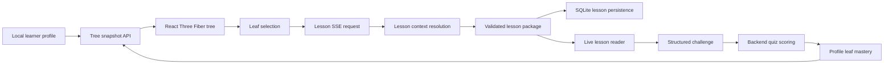

# The Learning Tree - Senior Engineering Case Study

## Executive Summary

The Learning Tree is a local-first AI education application built around a full-screen 3D learning tree. Learners choose a local profile, select topic leaves, receive structured lessons, complete challenges, and grow mastery over time. The system combines a FastAPI backend, SQLite persistence, schema-validated curriculum packages, Server-Sent Events, and a React Three Fiber interface.

I built this project as more than a prompt demo. The goal was to design a production-shaped learning system that keeps learner data local, treats AI output as a controlled subsystem, and gives the user a responsive experience even when local inference is slow or unavailable. My background as a Navy veteran and former industrial operations manager influenced the architecture: I approached the project as a reliability and workflow problem, not just a UI or model-integration exercise.

## Problem

Many AI education prototypes fail at the system boundaries. They can generate text, but they often do not persist learner state, do not track mastery, do not handle model failures cleanly, and do not give parents or learners a clear record of what happened. They also tend to assume cloud-hosted inference, which creates privacy and deployment tradeoffs for families, classrooms, and offline or constrained environments.

For this project, the technical problem was to build a local-first learning loop with the following requirements:

- Store learner profiles, lessons, progress, and curriculum state on the local machine.
- Keep the learner experience responsive while lesson content is being prepared.
- Avoid trusting unconstrained model text as the only source of curriculum truth.
- Preserve enough structure to support quizzes, mastery updates, lesson history, and future curriculum expansion.
- Use a child-facing visual interface without sacrificing testability or backend correctness.
- Surface local AI health and recovery states instead of silently failing.

The core engineering challenge was the end-to-end control loop: selection, lesson generation, streaming, persistence, assessment, mastery update, and visual feedback. A single chat endpoint would not have been enough.

## Architecture

The repository is organized as a local monorepo with a Python API and a TypeScript frontend:

- Backend: `apps/api`
- Frontend: `apps/web`
- Local data: `data/learning_tree.db`
- Setup scripts: `scripts/setup.ps1` and `scripts/run-dev.ps1`

The backend uses FastAPI, SQLAlchemy, SQLite, Pydantic, and local Ollama integration points. The frontend uses React 18, TypeScript, Vite, Three.js, React Three Fiber, Drei, and React Spring.

### Backend Responsibilities

The backend owns the correctness-sensitive parts of the system:

- Database bootstrapping and lightweight migrations.
- Profile creation and lookup.
- Tree snapshot assembly with profile-specific mastery merged into each leaf.
- Lesson history retrieval.
- Lesson package construction and persistence.
- Structured quiz scoring.
- Idempotent lesson completion.
- Branch expansion through generated leaves.
- Local AI health checks against Ollama.

The main API surface is implemented in `apps/api/app/routes/tree.py`. The data model is implemented in `apps/api/app/db/models.py`. The lesson and curriculum logic is split across `apps/api/app/services/lesson_engine.py`, `apps/api/app/services/curriculum.py`, and `apps/api/app/schemas/learning.py`.

### Frontend Responsibilities

The frontend owns the interactive learning experience:

- Profile selection and local profile recall.
- Tree loading and mapping API coordinates into renderable scene data.
- Full-screen 3D tree rendering.
- Touch, pointer, wheel, and keyboard navigation.
- Leaf selection and read-aloud behavior.
- SSE parsing and incremental lesson display.
- Warmup games while waiting for the first lesson content.
- Structured challenge UI.
- Reward game flow after completion.
- Parent menu with profile switching, recent lessons, health status, and branch tools.

The app shell is implemented in `apps/web/src/App.tsx`. The 3D tree is implemented in `apps/web/src/features/tree/components/LearningTreeCanvas.tsx`. The SSE client is implemented in `apps/web/src/lib/api.ts`.

## Data Model

The application persists learner and curriculum state in SQLite. The main tables are:

| Table | Purpose |
| --- | --- |
| `profiles` | Local learner profiles with display name, avatar seed, age band, and timestamps. |
| `grade_levels` | Ordered grade bands from Pre-K through Grade 12. |
| `subject_branches` | Subject branches for each grade, including render anchors and colors. |
| `leaves` | Topic nodes with coordinates, display radii, hit radii, descriptions, and seed prompts. |
| `lessons` | Generated or locally constructed lessons tied to a profile and leaf. |
| `profile_leaf_progress` | Per-profile mastery, completion count, last lesson, and completion timestamps. |
| `schema_migrations` | Lightweight local migration tracking. |

The backend enables SQLite foreign-key enforcement in `apps/api/app/db/session.py`. This matters because lesson history and progress rows are not just cache data. They are the record of learner state. The tests verify cascade behavior and `SET NULL` behavior for last-lesson references.

## Problem, Architecture, Solution

### Problem: Privacy-Preserving AI Tutoring Needs State, Not Just Text

The initial product problem was to create a learning experience that could run locally and preserve learner data privacy. That meant avoiding a design where every profile, lesson, and assessment was sent to a hosted service. It also meant treating the local model as one part of the system rather than the system itself.

The engineering risk was that a pure prompt-driven application would be hard to validate. If a lesson came back with inconsistent structure, missing vocabulary, no answer keys, or age-inappropriate complexity, the frontend would have no reliable way to score work or update mastery. The project needed a structured learning contract between backend and frontend.

### Architecture: Local-First Backend With Structured Curriculum Contracts

I designed the backend around explicit domain objects rather than generic chat messages. A selected leaf is resolved into a `LessonGenerationContext` that includes the profile, grade, subject, topic, current mastery, lesson count, and related progress. From there, the backend builds a `LessonPackage` with a required teaching sequence, vocabulary, guided practice, quiz questions, and mastery evidence.

The important architectural decision was to make the structured package the contract. The frontend can render lesson sections, vocabulary cards, worked examples, and structured questions because the backend validates the shape before persistence. Quiz scoring happens on the backend against answer keys, which keeps mastery updates tied to server-side logic rather than browser-only state.

The active lesson stream uses SSE events such as `start`, `token`, `replace`, `complete`, and `error`. This gives the UI a streaming interface and a recoverable state machine without requiring WebSockets. The current MVP favors local validated curriculum packages for reliability. The codebase also includes Ollama model selection, streaming helpers, branch generation, and AI health checks so local model integration can be expanded without changing the user-facing learning loop.

### Solution: End-to-End Learning Loop

The delivered MVP supports the full learner flow:

1. Create or select a local profile.
2. Load a profile-specific tree snapshot from SQLite.
3. Select a topic leaf in the 3D tree.
4. Open a lesson reader immediately with a provisional lesson state.
5. Stream lesson content through SSE.
6. Save the lesson locally.
7. Render structured sections, vocabulary, examples, and practice.
8. Complete a challenge.
9. Score the challenge on the backend.
10. Persist completion state and update profile-specific mastery.
11. Refresh the tree so visual state reflects progress.

This turns lesson generation into a controlled workflow. The UI does not have to infer what a lesson means. The backend stores enough metadata to replay lesson history, show recovery notices, score structured questions, and keep mastery state consistent.

## Local AI Strategy

The project is designed around local inference rather than hosted AI APIs. The configuration supports a local Ollama server and model settings through `LEARNING_TREE_` environment variables:

- `LEARNING_TREE_OLLAMA_BASE_URL`
- `LEARNING_TREE_OLLAMA_FAST_MODEL`
- `LEARNING_TREE_OLLAMA_ADVANCED_MODEL`
- `LEARNING_TREE_LESSON_TEMPERATURE`
- `LEARNING_TREE_OLLAMA_TIMEOUT_SECONDS`

The design separates local AI availability from application correctness. The app can check Ollama health through `/api/health/ai`, display readiness in the parent menu, and fall back to local deterministic curriculum behavior when needed. Branch expansion uses generated subtopic suggestions when possible and deterministic fallback suggestions when local model generation fails.

That separation is deliberate. For a local-first educational product, the app should remain inspectable and usable even when the model is missing, slow, or temporarily offline. Local AI is a capability, not a single point of failure.

## Streaming And Responsiveness

The frontend lesson flow is designed around perceived responsiveness:

- The lesson reader opens immediately.
- A provisional lesson object is created before content arrives.
- A warmup game appears only while waiting for the first lesson token.
- SSE events incrementally update the active lesson.
- The stream can be aborted when the learner changes profile, closes the lesson, or selects another leaf.
- Completion refreshes both lesson history and tree progress.

The SSE parser in `apps/web/src/lib/api.ts` handles named JSON events and defaults unnamed events to `message`. This is a small but important boundary: the browser does not receive one giant opaque response. It receives a sequence of state transitions that the UI can render safely.

## Curriculum And Assessment Design

The curriculum layer uses explicit schemas rather than freeform text:

- Required section sequence: objective, hook, direct teaching, worked example, guided practice, common mistake, independent check, recap.
- Grade complexity tiers: early, elementary, middle, high.
- Tier-specific quiz counts.
- Vocabulary terms with definitions.
- Worked examples with steps and answers.
- Guided practice prompts.
- Mastery evidence statements.
- Question types including multiple choice, fill blank, sequence, classify, and short response.

The backend rejects malformed packages through Pydantic validation. It also rejects generic filler phrases and validates quiz structure. This is a strong engineering choice for AI-assisted education because it creates guardrails around content quality and assessment reliability.

The completion endpoint supports both structured quiz answers and a legacy score path. For structured packages, the backend scores each answer against the stored quiz definition and returns detailed feedback. Progress updates are idempotent: completing the same lesson twice does not double-count mastery.

## 3D Frontend And Learning State

The 3D tree is not just decorative. It is the visual representation of learner state.

The API returns grade, branch, and leaf data with coordinates and mastery levels. The frontend maps that into a Three.js scene with:

- A vertically navigable trunk.
- Grade markers.
- Subject branches.
- Leaves with large invisible hit targets for child-friendly tapping.
- Mastery-dependent visual rejuvenation.
- Branch health states based on average mastery.
- Subject-specific visual motifs.
- Keyboard and pointer navigation.

The visual system is driven by data from the backend. A completed challenge updates `profile_leaf_progress`, which changes the tree snapshot, which changes the rendered leaf and branch state. That makes the UI a direct reflection of persisted learning state.

## Reliability And Failure Handling

The project includes several reliability decisions:

- SQLite foreign keys are explicitly enabled.
- Startup bootstraps and seeds the local database.
- Lightweight migrations are recorded in `schema_migrations`.
- API routes validate profile and leaf existence.
- Lesson stream events include error and recovery paths.
- Saved lessons preserve recovery metadata.
- Completion logic is idempotent.
- AI health is checked separately from normal tree loading.
- Branch generation deduplicates generated leaves and falls back to deterministic suggestions.
- The frontend aborts stale streams when profile or leaf state changes.

These are small production-shaped decisions. They keep the app from turning into a brittle demo where refreshing the page, changing profiles, or losing local model connectivity corrupts the learning flow.

## Testing Strategy

The repository includes backend and frontend tests covering the highest-risk behavior:

Backend tests include:

- Profile validation.
- Tree profile lookup errors.
- Lesson history recovery metadata.
- Idempotent lesson completion.
- Structured backend quiz scoring.
- SQLite foreign-key behavior.
- Migration recording.
- Lesson content normalization.
- Curriculum package validation.

Frontend tests include:

- SSE event parsing.
- Lesson reader behavior.
- Lesson challenge behavior.
- Profile selector behavior.
- Reward and warmup game behavior.
- Tree visual logic.
- Game target extraction.

The tests are focused on contracts rather than superficial rendering. That matches the risk profile of the project: persistence, structured curriculum, streaming state, and mastery updates are the parts that must not regress.

## Key Engineering Tradeoffs

### Deterministic Curriculum Before Fully Dynamic Generation

The project currently favors validated local curriculum packages for the lesson path. That is less flashy than unconstrained live generation, but it is better aligned with a child-facing MVP. It guarantees the frontend receives sections, vocabulary, quiz questions, answer keys, and mastery evidence in a predictable shape.

The local Ollama integration remains important, but it is treated as an expandable subsystem. This is the right order of operations: stabilize the learning contract first, then expand model-driven generation behind that contract.

### SSE Instead Of WebSockets

SSE is a pragmatic fit for one-direction lesson streaming. The client starts a request, receives named events, and updates the UI. WebSockets would add complexity without a clear need for bidirectional realtime coordination in the current product.

### SQLite Instead Of A Server Database

SQLite fits the local-first privacy goal. It keeps setup simple, supports durable local state, and is enough for a single-machine MVP. The tradeoff is that packaging, backup, sync, multi-device profiles, and concurrent classroom use would require additional design.

### React Three Fiber For The Primary Interface

A 3D tree creates a strong learning metaphor and gives mastery progress a visible shape. The tradeoff is frontend complexity: performance, interaction handling, accessibility, and code-splitting need more care than a standard dashboard. The project addresses this with an accessible leaf navigator, larger hit targets, keyboard controls, lazy loading, and tested visual state helpers.

## Evidence-Backed Outcomes

This repository currently demonstrates:

- A working local profile model.
- Seeded grade, subject, and leaf data in SQLite.
- Profile-specific mastery merged into tree snapshots.
- A React Three Fiber tree interface.
- SSE-based lesson delivery.
- Local lesson persistence.
- Structured lesson packages.
- Backend-scored quizzes.
- Idempotent lesson completion.
- Mastery-based tree updates.
- Warmup and reward game flows.
- Web Speech API support.
- Local AI health checks.
- Dynamic branch leaf generation with fallback behavior.
- Backend and frontend regression tests.
- One-command local setup and run scripts.

These are implementation-backed claims. The repository does not currently include production usage metrics, measured latency benchmarks, learner outcome studies, or hosted deployment telemetry, so those claims should not be made in interviews unless they are measured later.

## Limitations

The project is an MVP, not a finished infinite-curriculum platform.

Current limitations include:

- The canopy is finite rather than truly infinite.
- Curriculum coverage is broad but still shallow at each grade and subject.
- Migration tooling is lightweight and local, not a full Alembic workflow.
- Local model quality depends on the installed Ollama model and machine resources.
- Advanced citation-grounded academic workflows are not implemented.
- End-user packaging is limited to local setup and run scripts.
- The app is not designed for regulated or high-stakes learning environments.

These limitations are useful interview material because they show clear technical judgment. The system has a coherent MVP boundary rather than pretending to be complete.

## What I Would Improve Next

If I continued hardening this project, I would prioritize:

1. Add a formal migration tool such as Alembic while preserving simple local setup.
2. Add stronger lesson generation adapters that produce `LessonPackage` data through local models but must pass schema validation.
3. Add benchmark instrumentation for first-token time, total lesson generation time, and fallback rate.
4. Expand curriculum specifications with better grade coverage and source-grounded advanced content.
5. Package the app for non-developer local installation.
6. Add backup and export workflows for local learner data.
7. Add broader browser and accessibility testing around the 3D interface.

## Senior Interview Narrative

The concise version I would use in an interview:

> I built The Learning Tree as a local-first AI tutoring platform, not just a lesson generator. The interesting engineering work was the control loop: local profiles, tree state, structured curriculum packages, streamed lesson delivery, backend-scored challenges, idempotent mastery updates, and a 3D frontend that reflects persisted progress. I deliberately reduced model orchestration complexity for the MVP because reliability, privacy, and assessment structure mattered more than having a complicated agent graph. The result is a production-shaped local system where AI is integrated behind validated contracts instead of being trusted as an uncontrolled text source.

## Source Map

Important files to reference in interviews:

| Area | Path |
| --- | --- |
| API entrypoint | `apps/api/app/main.py` |
| API routes and learning loop | `apps/api/app/routes/tree.py` |
| Database models | `apps/api/app/db/models.py` |
| Database startup and seeding | `apps/api/app/db/bootstrap.py` |
| SQLite engine and foreign keys | `apps/api/app/db/session.py` |
| Lesson engine and local AI integration | `apps/api/app/services/lesson_engine.py` |
| Curriculum specifications | `apps/api/app/services/curriculum.py` |
| Structured lesson schemas | `apps/api/app/schemas/learning.py` |
| Frontend app shell | `apps/web/src/App.tsx` |
| SSE client | `apps/web/src/lib/api.ts` |
| 3D tree renderer | `apps/web/src/features/tree/components/LearningTreeCanvas.tsx` |
| Lesson reader | `apps/web/src/features/lessons/components/LessonReader.tsx` |
| Challenge modal | `apps/web/src/features/lessons/components/LessonChallengeModal.tsx` |
| Backend tests | `apps/api/test_api_routes.py`, `apps/api/test_database_integrity.py`, `apps/api/test_learning_packages.py` |
| Frontend tests | `apps/web/src/**/*.test.ts`, `apps/web/src/**/*.test.tsx` |
